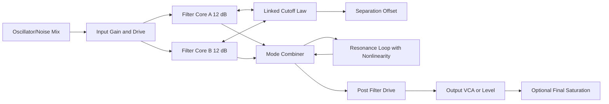
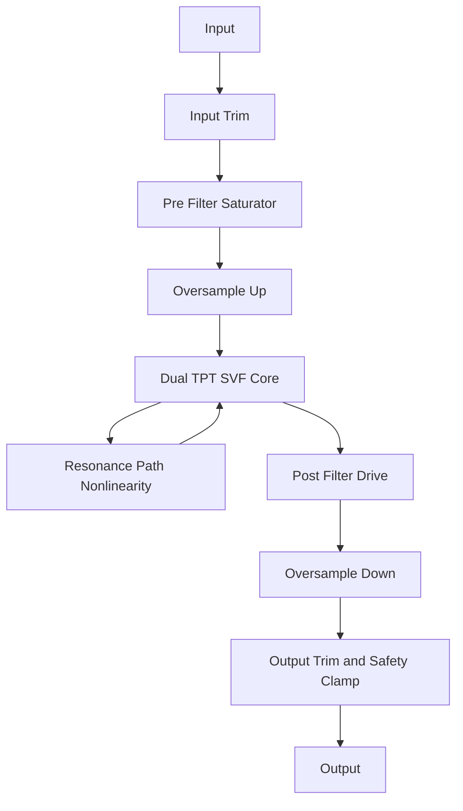
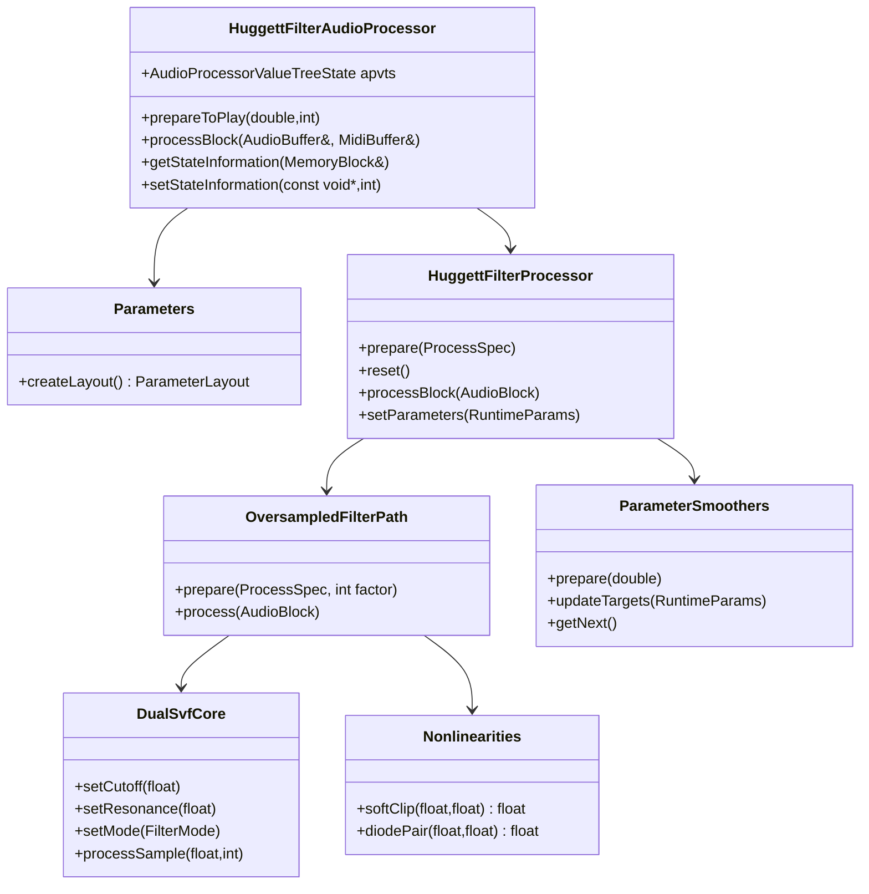

# Deep Research Report for a JUCE VST3 Emulation of Chris Huggett’s Summit Peak OSCar Filter

> **Project context.** This is external deep research on the Huggett filter lineage (OSCar → Peak → Summit). That filter is the **Huggett multimode filter at the head of our constant Summit spine** ([engine register](engine-questions.md) L2), so this report is the load-bearing architecture reference for **[v5 — Constant Summit voice](../roadmap/phases.md)**. One adaptation to keep in mind throughout: this report frames a **mono/stereo effect plugin** with one filter instance and global oversampling; in k2000 the filter is **per-voice at a 256-voice target in full stereo** (register Q1/Q2/Q11), which changes the cost calculus — most acutely for oversampling. The roadmap's v5 section distills these conclusions into our build sequence and routes the cost questions to the perf gate.

## Executive summary

The most defensible architectural conclusion from the available primary and near-primary sources is that a JUCE VST3 intended to evoke the **Chris Huggett lineage from OSCar to Peak/Summit** should not be built as a generic ladder filter. It should be built as a **dual, modulation-friendly state-variable-style OTA filter system with musically important gain staging before, around, and after the filter**, because that is how the documented hardware family actually presents itself. The original OSCar manual describes the filter as **two 12 dB/oct filters** that may act as **24 dB/oct low-pass or high-pass**, or as **band-pass with variable bandwidth**, with **frequency separation**, **resonance**, **self-oscillation**, **tracking**, and **programmable filter drive**. Peak and Summit official documentation then describe the later Novation implementation as **one state-variable OTA filter per voice**, with **12/24 dB slope**, **LP/BP/HP**, **dual-filter combinations**, **pre-filter overdrive**, **post-filter drive/distortion**, and additional distortion after voice summation. Taken together, these sources point toward a family resemblance centered on **OTA/state-variable behavior, cascaded or dual sections, and deliberate analog gain staging**, not merely “a resonant low-pass.” citeturn33view0turn32view0turn26search0turn48view0turn39view0

For a digital implementation, the most rigorous baseline is a **topology-preserving transform or zero-delay-feedback state-variable core** with **audio-rate-safe modulation**, plus **localized nonlinear elements** at the input drive stage, in the resonance loop, and optionally after the filter core. JUCE’s own DSP documentation explicitly recommends its TPT state-variable structures for fast modulation and notes that they are based on the analog state-variable circuit. Research on virtual-analog nonlinear filters further supports **delay-free-loop aware methods** for stable, real-time nonlinear behavior rather than naïve direct-form or old Chamberlin-style structures when high resonance and fast modulation matter. citeturn25search0turn25search1turn43search1turn44search0turn50academia60

The best product strategy for an AI coding agent is therefore to ship **two modes**. The first is a **calibrated “Summit/Peak-inspired” mode**: a dual SVF/TPT core with filter-mode combinations, separation, overdrive, filter-post-drive, and voice-style divergence. The second is an **“OSCar-inspired” mode** that constrains the topology and control law to the earlier documented behavior: linked dual 12 dB sections, LP/HP/BP, separation, stronger audible resonance splitting, and a more aggressive pre-filter drive law. This gives a single plugin a historically grounded center while remaining implementable and testable in JUCE. citeturn33view0turn26search0turn39view1

The main limitation in the present source set is that **publicly discoverable, machine-readable access to the original OSCar service schematic was incomplete in this session**. A service manual is clearly listed in public manual archives, and the operating manual is clear about the filter’s user-visible behavior, but the exact transistor-level original filter schematic was not fully extractable here. One detailed secondary review states that the OSCar’s filter and output amplifier are based on **LM13600 dual OTAs**, which is consistent with the OTA-centered design language of Huggett’s later instruments, but exact component values and biasing should be verified against the original service schematic before claiming transistor-level white-box authenticity. citeturn19search0turn31view0turn37view0turn36search0

## Corroborating dossier (2026-06-17)

A second external [research dossier](huggett-filter-dossier.md) was ingested 2026-06-17; it corroborates this report and adds load-bearing specifics now folded into v5:

- **No patents.** An exhaustive search found no patent naming Chris Huggett for any filter/oscillator, nor any assigned to OSC/Novation/Focusrite for the circuit. → No authoritative circuit disclosure exists (all topology is reverse-engineered), and **no patent barrier** to a behavioral replica.
- **Asymmetric saturation matters.** Huggett-family filters are "dirty"/edgy, not symmetric/warm — the drive shapers and resonance-path nonlinearity should be **asymmetric** (Zavalishin's asymmetric-saturation), not plain symmetric tanh. (Sharpens **Q15**.)
- **Summit's nine dual routings, verbatim:** LP→HP, LP→BP, HP→BP (series) · LP+HP, LP+BP, HP+BP, LP+LP, BP+BP, HP+HP (parallel) + Separation. (Sharpens **Q14**.)
- **OTA nonlinearity is well-grounded:** the DAFx 2022 EDP-Wasp VA model measured the CA3080 OTA's tanh I–V curve; the LM13700/NJM13600/CA3080 family shares it — so the gray-box tanh is principled, not a guess.
- **Concrete DSP refs for Plan 2:** Zavalishin *The Art of VA Filter Design* (nonlinear ZDF, antisaturators, asymmetric saturation, waveshaping antialiasing); Cytomic/Andrew Simper *SvfLinearTrapOptimised* (+ Fred Anton Corvest's Common-DSP port); JUCE `dsp::StateVariableTPTFilter` (linear core); ADAA for static shapers.
- **Build/calibration path (= Plan 2 structure):** (1) linear ZDF skeleton → (2) asymmetric tanh in integrators + resonance feedback + three drive shapers, oversampling ~4× → (3) **calibrate against the user's own Summit** (self-osc pitch-vs-note, 12/24 dB resonance sweeps, drive levels, Separation sweeps) → (4) per-voice Diverge/Drift + osc3→cutoff FM + master distortion.

## v5.2 implementation status (as of 2026-06-21)

As of v5.2, separation is **real in both 12 and 24 dB** via a symmetric `cutA/cutB` split (cutA = cutoff − sep/2, cutB = cutoff + sep/2). All **nine Summit dual routings** ship: series LP→HP, LP→BP, HP→BP; parallel LP+HP, LP+BP, HP+BP, LP+LP, BP+BP, HP+HP. BP is now **series HP·LP by construction** (separation = bandwidth control), replacing the old single 2-pole BP tap. The separation range has been widened to **±4 oct**, and `spine.huggett.routing` is the single source of truth for spine mode — it is seeded once from `filter.type` on migration and then owns the value. See [`docs/specs/2026-06-20-huggett-separation-design.md`](../specs/2026-06-20-huggett-separation-design.md) for the full design decisions, the OQ resolutions (OQ1–OQ5), and the §3/§4/§5/§6 DSP spec.

## Historical and technical background

The original **OSCar operating manual** is unusually explicit about the musical behavior of the filter. It describes a “**double filter with frequency separation control**,” “**programmable filter drive**,” and a filter section in which the instrument’s two filters may be configured as **24 dB/oct low-pass or high-pass**, or **12 dB/oct-per-side band-pass with variable bandwidth**. The same manual states that the OSCar’s filter is “actually **two filters**, each with **12 dB/octave** cut-off slope,” whose cutoffs move together but can be **separated by an adjustable amount**; in LP and HP, zero separation gives a **24 dB/oct** result, while in BP one filter acts as low-pass and the other as high-pass, and separation controls the band width. The manual also states that sufficiently high resonance causes the filters to **oscillate at their cut-off frequencies**, and that separation yields **two distinct resonances**, especially in band-pass mode. citeturn32view0turn32view2turn33view0

That matters because it frames the OSCar not as a simple monolithic resonant block, but as a **dual-section, linked-cutoff, separation-capable filter** whose sonic identity comes from the interaction of **mode**, **cutoff locking**, **cutoff offset**, **resonance**, and **pre-filter drive**. The manual also reveals that the final oscillator/noise mix is level-adjusted by a **filter drive control** before it is sent into the filter, meaning the front end is intentionally non-neutral. The same document gives a cutoff range from about **16 Hz to 16 kHz**, says separation reaches about **four octaves**, and exposes tracking either in normal mode or via keyboard/LFO routing. Those are exactly the kinds of behaviors that a plugin should model as first-class controls rather than as incidental consequences. citeturn32view0turn33view0

A detailed later review from Audiofanzine identifies the OSCar’s filter and output amplifier as being based on **LM13600 dual OTAs**. That is not the original service schematic, so it should be treated as corroborating secondary evidence rather than the final authority. However, it is technically plausible and consistent with the OSCar’s documented behavior: OTA-based multimode sections are a natural home for state-variable and linked dual-filter designs with current-controlled cutoff and controllable resonance. It also aligns with the larger Huggett through-line toward OTA-like, voltage-controlled analog building blocks. citeturn37view0turn36search0

The later **Peak** and **Summit** documentation makes the lineage even clearer. Novation’s official Peak simplified block diagram shows per-voice signal flow as **digital oscillators in FPGA → mixer → analogue overdrive → analogue filter → pre-VCA distortion → VCA**, with additional **post-VCA distortion** after voice summation and digital time-domain effects after the main VCA. Peak’s manual explicitly says distortion may be added **before the filter**, **after the filter**, and **after final voice summation**, and its Voice menu exposes **Filter Post Drive** and **Filter Divergence**. Summit’s official product documentation further specifies that each voice contains **one state-variable OTA filter**, supporting **12/24 dB slope**, **low-pass, band-pass, high-pass**, and **dual-filter combinations**, along with **pre-filter overdrive** and **post-filter distortion**, while also exposing **expression pedal** and **CV input** as modulation sources for destinations including filter cutoff, resonance, and distortion. citeturn48view0turn39view1turn26search0turn39view0turn39view3

The continuous-time interpretation that best fits these sources is a **state-variable family** rather than a ladder family. In canonical form, a second-order SVF uses a shared denominator

\[
D(s)=s^2+\frac{\omega_0}{Q}s+\omega_0^2
\]

with the standard simultaneous outputs

\[
H_{LP}(s)=\frac{\omega_0^2}{D(s)}, \quad
H_{BP}(s)=\frac{\omega_0}{Q}\frac{s}{D(s)}, \quad
H_{HP}(s)=\frac{s^2}{D(s)}.
\]

The OSCar behavior then looks like a **linked pair of 12 dB sections** whose relative cutoff is offset by a **separation** parameter and whose outputs are combined differently depending on mode: serial alignment for steeper LP/HP behavior, or LP+HP interaction for band-pass and vocal-like effects. Summit’s documented “dual filter” combinations are an overt modern counterpart of the same idea. This is precisely why a digital emulation should preserve **simultaneous multimode outputs and cutoff-offset relationships**, not just a single output mode. citeturn33view0turn26search0turn25search0turn50search1

At the component-behavior level, the **OTA** evidence is important. Texas Instruments describes the LM13700 family as **current-controlled transconductance amplifiers** with **linearizing diodes** that allow higher input level and reduced distortion. Sound Semiconductor’s SSI2164 documentation describes it as a **voltage-controlled current amplifier** with an exponential control law of approximately **−33 mV/dB**, and its official filter application note explicitly says the part can be used as an **OTA-style VCF building block** and even recreates classic synthesizer filter topologies. This matters because a convincing model should not treat cutoff and resonance as abstract coefficients alone; it should treat them as the audible result of **bias-controlled transconductance**, **non-ideal input linearity**, and **gain staging around a current-mode core**. citeturn28search0turn30search13turn29search12

An analytical reconstruction of the likely Huggett-style abstraction for plugin work therefore looks like this:



That diagram should be treated as an **engineering reconstruction**, not a claim that it is the verbatim original schematic. It is, however, faithful to the behavior documented in the OSCar manual and the signal-flow architecture documented by Novation for Peak and Summit. citeturn33view0turn48view0turn26search0

## Digital modeling recommendations

The correct baseline for the core filter is a **state-variable TPT/ZDF implementation**, not a naïve Chamberlin or direct-form biquad. JUCE documents its `StateVariableFilter::Filter` and `StateVariableTPTFilter` as **TPT structures**, based on the **analog state-variable filter circuit**, and specifically notes that they are intended for **fast modulation** and help prevent the loud artifacts often found when cutoff is changed in less appropriate structures. D’Angelo and Välimäki’s work on nonlinear virtual-analog filters further underscores that delay-free loops created by discretized nonlinear feedback must be handled explicitly if one wants both stable behavior and correct local linear response. citeturn25search0turn25search1turn43search1turn44search1

That leads to a simple recommendation hierarchy:

| Method | Why it is attractive | Main weakness | Recommendation for this project |
|---|---|---|---|
| Classic Chamberlin SVF | Very simple, very cheap, familiar | Accuracy and tuning degrade at high cutoff/resonance; older forms are modulation-sensitive | Useful only as a prototype or test oracle, not as the shipping core. citeturn50academia60turn25search0 |
| Bilinear-transformed fixed biquad | Easy frequency-response matching in the linear case | Poor fit for embedded nonlinear feedback and multimode analog-style structure | Suitable for utility EQs, not for the main Huggett core. citeturn43search3turn25search6 |
| TPT/ZDF SVF | Preserves analog topology intuition; safe under modulation; direct multimode outputs | Nonlinear feedback still needs careful implementation | **Best default core** for Peak/Summit/OSCar-inspired emulation. citeturn25search0turn25search1turn43search1 |
| Fully implicit circuit solver or WDF-like approach | Highest possible circuit faithfulness in principle | Higher implementation complexity and CPU cost | Keep as future work unless exact service-schematic matching becomes the goal. citeturn43search1turn44search1 |

For this plugin, I recommend a **hybrid white-box / gray-box** approach:

1. Use a **dual TPT SVF core** with simultaneous LP/BP/HP outputs.
2. Realize **LP/HP/BP/dual** behavior by combining or cascading the two sections in ways that mirror OSCar separation and Summit dual-filter logic.
3. Apply **nonlinearity at three places**: input drive, resonance loop, and post-filter stage.
4. Oversample only the parts that need it: the nonlinear filter path, not the whole plugin UI or parameter system.
5. Use **audio-rate parameter smoothing** for cutoff, resonance, separation, and drive. citeturn26search0turn39view0turn23search1turn23search2

A practical signal-flow recommendation is:



This is more faithful to the documented lineage than a single saturating low-pass, because Peak/Summit clearly place nonlinear stages **before** and **after** the filter, and the OSCar manual explicitly exposes **filter drive** at the input of the filter path. citeturn48view0turn39view0turn32view0

### Nonlinear element models

The most useful nonlinear abstractions are these:

| Model | Mathematical form | What it emulates best | Cost | Recommendation |
|---|---|---|---|---|
| `tanh(x)` | Smooth odd soft clip | Differential-pair / OTA-like limiting in VA DSP literature | Moderate | **Best default** for input and resonance-path limiting. citeturn44search0turn43search1 |
| Antiparallel diode pair | Piecewise exponential or smoothed diode law | Harder clamp and self-oscillation limiting | Moderate to high | Good for an “OSCar aggressive” mode. Sound Semiconductor’s VCF note explicitly uses antiparallel diodes to control self-oscillation amplitude. citeturn30search14 |
| OTA differential approximation | `I_out = g_m * sinh-like or tanh-like input relation` | Bias-controlled transconductance behavior | Higher | Best for the resonance VCA or cutoff-control internals if you want a more white-box model. citeturn28search0turn44search0 |
| 2164/2161 exponential gain cell law | Voltage-to-current gain law in dB | VCA-style resonance control and later Huggett-family VCA-based blocks | Low to moderate | Strong choice for control-law shaping and resonance-depth scaling, especially in a Peak/Summit-inspired mode. citeturn29search12turn30search13 |

The safest numerical advice is:

- Use **`std::tanh` or a bounded rational approximation** for the first version.
- Keep the saturator **inside the oversampled region**.
- Use **one or two Newton/fixed-point refinement steps per sample** only where the nonlinearity closes a loop.
- Bound resonance and internal states to prevent runaway at pathological automation settings.
- Keep the control law and the audio nonlinearity conceptually separate. OTA or VCA exponential control should shape cutoff or resonance behavior; audio-path saturation should shape tone. citeturn43search1turn44search0turn23search2

A reasonable first-pass numerical form for the resonance-path nonlinearity is:

\[
u = x - k \cdot \phi(y_{fb}), \qquad \phi(v)=\tanh(\alpha v)
\]

where `k` is the resonance coefficient and `α` is the drive/saturation slope. If you want a more OTA-like interpretation, make `k` a function of a transconductance control current or an exponentialized resonance parameter. That gives the right musical effect: resonance grows, then compresses and self-limits rather than numerically exploding. This mirrors both the OTA device behavior described by TI and the explicit self-oscillation amplitude limiting discussed in modern VCF design notes. citeturn28search0turn30search14

### Oversampling and anti-aliasing

JUCE’s oversampling class supports **2x, 4x, 8x, or 16x**, with **polyphase allpass IIR** or **FIR** designs, and explicitly states that oversampling is used to reduce aliasing from nonlinear processes. That makes the practical recommendation straightforward. Use **2x as the default real-time mode**, **4x as the high-quality real-time mode**, and reserve **8x** for offline render or enthusiast mode. I would not make 16x the default in a polyphonic or stereo-heavy plugin unless profiling proves it is viable on mainstream machines, because latency and CPU cost climb quickly. The “2x default / 4x HQ / 8x render” recommendation is an engineering judgment built on JUCE’s supported factors and the fact that your nonlinearity is localized around the filter, not spread across the entire plugin. citeturn23search2

| Oversampling factor | Best use | Latency/CPU profile | Suggested anti-alias strategy |
|---|---|---|---|
| 1x | Debugging only | Lowest | Not recommended for shipping nonlinear modes |
| 2x | Default real-time | Low to moderate | IIR polyphase if low latency matters |
| 4x | High-quality real-time | Moderate | FIR if phase symmetry matters more than latency |
| 8x | Offline render / premium mode | High | FIR preferred; only for strong drive or extreme resonance |
| 16x | Research mode | Very high | Usually not worth it for a musical filter plugin |

For anti-aliasing, the plugin should lean on JUCE’s oversampling filters for up/down conversion, then add only two targeted strategies of its own: a **DC blocker** after the nonlinear core if required, and a **gentle output safety limiter or clipper** that lives outside the resonance logic so it does not falsify the filter behavior. The main anti-alias burden should be borne by **oversampling plus keeping the nonlinearity inside the oversampled block**, not by brute-force post-EQ. citeturn23search2turn40search0

## Control mapping and calibration

The user-visible controls should follow the documented hardware concepts rather than generic DSP names. The essential public parameters are **cutoff**, **resonance**, **mode**, **slope**, **separation**, **input drive**, **post drive**, **key tracking**, **filter divergence**, **output trim**, and at least one **external modulation input amount** to stand in for CV/expression automation. The OSCar manual, the Peak voice menu, and Summit’s modulation matrix all justify this parameter vocabulary. Summit explicitly includes **Expression pedals** and **CV input** as modulation sources, and exposes filter cutoff, resonance, distortion, and VCA level as destinations. Peak additionally exposes **Filter Post Drive** and **Filter Divergence**. citeturn33view0turn39view1turn39view3

A good control-law design is:

- **Cutoff**: normalized control mapped exponentially to Hz, approximately 16 Hz to 20 kHz, with internal clamping to a more conservative top end under high resonance and low sample rate.
- **Resonance**: normalized control mapped to a musically useful `Q` or feedback coefficient with a shaped taper so the first half is subtle and the upper range compresses toward self-oscillation.
- **Separation**: zero-centered in Summit/Peak dual mode; one-sided positive in OSCar mode if you want to mimic the original panel.
- **Drive**: dB-like mapping into input gain before saturation.
- **Post Drive**: independent post-filter drive, following Peak’s documented architecture.
- **Key Tracking / External CV / Expression**: semitone-consistent scaling, not arbitrary linear frequency offsets. citeturn33view0turn39view1turn39view3

For calibration, there are three layers.

First, **linear calibration**: at low drive and low resonance, the digital LP/BP/HP responses should match the expected analog target curves at multiple sample rates. Peak and Summit documentation are strong enough to justify calibrating around **multimode SVF behavior** rather than around ladder shelves or a fixed Moog-derived response. citeturn26search0turn25search0

Second, **resonance calibration**: the onset of self-oscillation should be consistent across pitch and sample rate. That does not mean numerically identical `Q` values at every sample rate; it means the user’s knob produces consistent musical behavior. D’Angelo and related nonlinear-filter work supports treating the filter as a nonlinear dynamic system whose stability and effective response depend on both parameterization and local operating point. citeturn43search1turn44search1

Third, **nonlinear tone calibration**: use stepped level sweeps, not just FFTs. Match how the filter behaves at three to five input amplitudes and three resonance settings. The OSCar manual is especially helpful here because it makes “filter drive” a first-class sonic control rather than a hidden trim, so the plugin should deliberately preserve tone differences as input level changes. citeturn32view0turn33view0

A useful APVTS-facing parameter set is:

| ID | Type | Range | Suggested law |
|---|---|---|---|
| `cutoff` | float | 16 Hz … 20000 Hz | skewed normalisable or exponential Hz |
| `resonance` | float | 0 … 1 | nonlinear taper to feedback/Q |
| `mode` | choice | LP, BP, HP, DualLPHP, DualLPBP, DualHPBP, OscarLP, OscarHP, OscarBP | discrete |
| `slope` | choice | 12 dB, 24 dB | discrete |
| `separation` | float | 0 … 1 or bipolar | exponential/octave offset |
| `driveIn` | float | −24 … +24 dB | linear dB |
| `drivePost` | float | 0 … +24 dB | linear dB |
| `keyTrack` | float | 0 … 1 | semitone/octave mapping |
| `extModAmount` | float | −1 … +1 | bipolar |
| `divergence` | float | 0 … 1 | random-fixed-per-channel offset |
| `oversampling` | choice | 1x, 2x, 4x, 8x | discrete |
| `quality` | choice | Eco, Normal, High | discrete policy |
| `outputTrim` | float | −24 … +12 dB | linear dB |

## JUCE and VST3 architecture with code skeletons

The cleanest JUCE layout is a **thin plugin wrapper** around a reusable DSP model object. JUCE’s `AudioProcessorValueTreeState` is designed to hold the processor state and parameter layout, `SmoothedValue` is the correct built-in utility for glitch-free parameter smoothing, and JUCE’s oversampling API already gives you the main real-time infrastructure you need. The processor should do almost no direct DSP except buffer orchestration and state serialization; the filter model should live in its own module-like folder so it can be unit-tested without the plugin shell. citeturn23search0turn23search1turn23search2turn40search0

A concrete file structure suitable for an AI coding agent is:

```text
Source/
  PluginProcessor.h
  PluginProcessor.cpp
  PluginEditor.h
  PluginEditor.cpp
  Parameters.h
  Parameters.cpp
  dsp/
    HuggettFilterProcessor.h
    HuggettFilterProcessor.cpp
    DualSvfCore.h
    DualSvfCore.cpp
    Nonlinearities.h
    Nonlinearities.cpp
    ParameterSmoothers.h
    ParameterSmoothers.cpp
    OversampledFilterPath.h
    OversampledFilterPath.cpp
    Calibration.h
    Calibration.cpp
    FilterModes.h
  tests/
    FilterMathTests.cpp
    ParameterMappingTests.cpp
    StabilityTests.cpp
    RegressionAudioTests.cpp
```

A useful class relationship looks like this:



### Public APIs

```cpp
// dsp/FilterModes.h
#pragma once

namespace huggett
{
    enum class FilterMode
    {
        lowPass,
        bandPass,
        highPass,
        dualLpHp,
        dualLpBp,
        dualHpBp,
        oscarLowPass,
        oscarHighPass,
        oscarBandPass
    };

    enum class FilterSlope
    {
        dB12,
        dB24
    };

    struct RuntimeParams
    {
        float cutoffHz = 1000.0f;
        float resonance = 0.1f;     // user domain 0..1
        float separation = 0.0f;    // normalized or octaves, finalized in mapping layer
        float driveInDb = 0.0f;
        float drivePostDb = 0.0f;
        float keyTrack = 0.0f;
        float divergence = 0.0f;
        float extModAmount = 0.0f;
        float outputTrimDb = 0.0f;
        FilterMode mode = FilterMode::lowPass;
        FilterSlope slope = FilterSlope::dB24;
        bool nonlinear = true;
    };
}
```

```cpp
// dsp/HuggettFilterProcessor.h
#pragma once
#include <JuceHeader.h>
#include "FilterModes.h"
#include "OversampledFilterPath.h"
#include "ParameterSmoothers.h"

namespace huggett
{
    class HuggettFilterProcessor
    {
    public:
        void prepare (const juce::dsp::ProcessSpec& spec, int oversamplingFactor);
        void reset();
        void setParameterTargets (const RuntimeParams& params);
        void process (juce::dsp::AudioBlock<float>& block);

    private:
        RuntimeParams currentTargets {};
        ParameterSmoothers smoothers;
        OversampledFilterPath filterPath;
        double sampleRate = 44100.0;
        int maxBlockSize = 0;
        int numChannels = 2;
    };
}
```

```cpp
// Source/PluginProcessor.h
#pragma once
#include <JuceHeader.h>
#include "Parameters.h"
#include "dsp/HuggettFilterProcessor.h"

class HuggettFilterAudioProcessor final : public juce::AudioProcessor
{
public:
    HuggettFilterAudioProcessor();
    ~HuggettFilterAudioProcessor() override = default;

    void prepareToPlay (double sampleRate, int samplesPerBlock) override;
    void releaseResources() override;
    bool isBusesLayoutSupported (const BusesLayout& layouts) const override;
    void processBlock (juce::AudioBuffer<float>&, juce::MidiBuffer&) override;

    juce::AudioProcessorEditor* createEditor() override;
    bool hasEditor() const override { return true; }

    const juce::String getName() const override { return "HuggettFilter"; }
    bool acceptsMidi() const override { return false; }
    bool producesMidi() const override { return false; }
    bool isMidiEffect() const override { return false; }
    double getTailLengthSeconds() const override { return 0.0; }

    int getNumPrograms() override { return 1; }
    int getCurrentProgram() override { return 0; }
    void setCurrentProgram (int) override {}
    const juce::String getProgramName (int) override { return {}; }
    void changeProgramName (int, const juce::String&) override {}

    void getStateInformation (juce::MemoryBlock& destData) override;
    void setStateInformation (const void* data, int sizeInBytes) override;

    juce::AudioProcessorValueTreeState apvts;

private:
    huggett::HuggettFilterProcessor model;
    JUCE_DECLARE_NON_COPYABLE_WITH_LEAK_DETECTOR (HuggettFilterAudioProcessor)
};
```

### APVTS parameter layout

```cpp
// Source/Parameters.cpp
#include "Parameters.h"

juce::AudioProcessorValueTreeState::ParameterLayout createParameterLayout()
{
    using namespace juce;

    std::vector<std::unique_ptr<RangedAudioParameter>> params;

    auto hzRange = NormalisableRange<float> (16.0f, 20000.0f, 0.0f, 0.18f);
    auto unitRange = NormalisableRange<float> (0.0f, 1.0f);
    auto bipolarRange = NormalisableRange<float> (-1.0f, 1.0f);
    auto dbRange = NormalisableRange<float> (-24.0f, 24.0f, 0.01f);

    params.push_back (std::make_unique<AudioParameterFloat> ("cutoff", "Cutoff", hzRange, 1000.0f));
    params.push_back (std::make_unique<AudioParameterFloat> ("resonance", "Resonance", unitRange, 0.10f));
    params.push_back (std::make_unique<AudioParameterChoice> ("mode", "Mode",
        StringArray { "LP", "BP", "HP", "Dual LP>HP", "Dual LP>BP", "Dual HP>BP", "OSCar LP", "OSCar HP", "OSCar BP" }, 0));
    params.push_back (std::make_unique<AudioParameterChoice> ("slope", "Slope",
        StringArray { "12 dB/oct", "24 dB/oct" }, 1));
    params.push_back (std::make_unique<AudioParameterFloat> ("separation", "Separation", unitRange, 0.0f));
    params.push_back (std::make_unique<AudioParameterFloat> ("driveIn", "Input Drive", dbRange, 0.0f));
    params.push_back (std::make_unique<AudioParameterFloat> ("drivePost", "Post Drive", NormalisableRange<float> (0.0f, 24.0f), 0.0f));
    params.push_back (std::make_unique<AudioParameterFloat> ("keyTrack", "Key Tracking", unitRange, 0.0f));
    params.push_back (std::make_unique<AudioParameterFloat> ("extModAmount", "External Mod Amount", bipolarRange, 0.0f));
    params.push_back (std::make_unique<AudioParameterFloat> ("divergence", "Divergence", unitRange, 0.0f));
    params.push_back (std::make_unique<AudioParameterChoice> ("oversampling", "Oversampling",
        StringArray { "1x", "2x", "4x", "8x" }, 1));
    params.push_back (std::make_unique<AudioParameterChoice> ("quality", "Quality",
        StringArray { "Eco", "Normal", "High" }, 1));
    params.push_back (std::make_unique<AudioParameterFloat> ("outputTrim", "Output Trim",
        NormalisableRange<float> (-24.0f, 12.0f), 0.0f));

    return { params.begin(), params.end() };
}
```

### Critical implementation snippets

A **nonlinear core step** should look like this. This is intentionally a skeleton, not a finalized model:

```cpp
// dsp/Nonlinearities.h
#pragma once
#include <cmath>

namespace huggett::nl
{
    inline float softClipTanh (float x, float drive) noexcept
    {
        // drive is a slope-like multiplier, typically 0.5 .. 4.0
        return std::tanh (drive * x);
    }

    inline float diodePairSoft (float x, float amount) noexcept
    {
        // Smoothed antiparallel-diode style approximation.
        // amount should be kept modest and used inside OS.
        const float a = std::max (0.001f, amount);
        return std::sinh (a * x) / (1.0f + std::cosh (a * x));
    }
}
```

A **practical ZDF/TPT resonance update** can begin with one explicit refinement step:

```cpp
// dsp/DualSvfCore.cpp
float DualSvfCore::processSample (float x, int ch) noexcept
{
    // State per channel
    auto& s1 = z1[ch];
    auto& s2 = z2[ch];

    // g = tan(pi * fc / fs) computed in setCutoff()
    // R maps from resonance control; larger R means more damping
    // k is feedback gain derived from user resonance and calibration

    // First estimate
    float ybp = s1;
    float ylp = s2;
    float fb  = nonlinear ? nl::softClipTanh (ybp * resonanceSense, satDrive) : ybp;
    float u   = x - k * fb;

    // TPT SVF step
    const float hp = (u - (R + g) * s1 - s2) * h; // h = 1 / (1 + Rg + g^2)
    const float bp = g * hp + s1;
    const float lp = g * bp + s2;

    s1 = g * hp + bp;
    s2 = g * bp + lp;

    return mixOutputs (hp, bp, lp, ch);
}
```

A **parameter smoother block** should rely on `SmoothedValue`, using multiplicative smoothing for frequency-like parameters and linear smoothing for most others, because JUCE explicitly notes multiplicative smoothing is appropriate for logarithmic quantities such as frequency in Hz. citeturn23search1

```cpp
// dsp/ParameterSmoothers.h
#pragma once
#include <JuceHeader.h>
#include "FilterModes.h"

namespace huggett
{
    struct SmoothedParams
    {
        float cutoffHz;
        float resonance;
        float separation;
        float driveInDb;
        float drivePostDb;
        float outputTrimDb;
    };

    class ParameterSmoothers
    {
    public:
        void prepare (double sampleRate)
        {
            cutoff.reset (sampleRate, 0.01);
            resonance.reset (sampleRate, 0.01);
            separation.reset (sampleRate, 0.01);
            driveInDb.reset (sampleRate, 0.01);
            drivePostDb.reset (sampleRate, 0.01);
            outputTrimDb.reset (sampleRate, 0.01);
        }

        void setTargets (const RuntimeParams& p)
        {
            cutoff.setTargetValue (p.cutoffHz);
            resonance.setTargetValue (p.resonance);
            separation.setTargetValue (p.separation);
            driveInDb.setTargetValue (p.driveInDb);
            drivePostDb.setTargetValue (p.drivePostDb);
            outputTrimDb.setTargetValue (p.outputTrimDb);
        }

        SmoothedParams getNext() noexcept
        {
            return {
                cutoff.getNextValue(),
                resonance.getNextValue(),
                separation.getNextValue(),
                driveInDb.getNextValue(),
                drivePostDb.getNextValue(),
                outputTrimDb.getNextValue()
            };
        }

    private:
        juce::SmoothedValue<float, juce::ValueSmoothingTypes::Multiplicative> cutoff { 1000.0f };
        juce::SmoothedValue<float> resonance { 0.1f }, separation { 0.0f }, driveInDb { 0.0f }, drivePostDb { 0.0f }, outputTrimDb { 0.0f };
    };
}
```

A **JUCE oversampling wrapper** should keep only the nonlinear path oversampled:

```cpp
// dsp/OversampledFilterPath.h
#pragma once
#include <JuceHeader.h>
#include "DualSvfCore.h"

namespace huggett
{
    class OversampledFilterPath
    {
    public:
        void prepare (const juce::dsp::ProcessSpec& spec, int factorAsPowerOfTwo)
        {
            oversampling = std::make_unique<juce::dsp::Oversampling<float>>(
                static_cast<size_t> (spec.numChannels),
                static_cast<size_t> (factorAsPowerOfTwo),
                juce::dsp::Oversampling<float>::filterHalfBandPolyphaseIIR,
                true);

            oversampling->initProcessing (static_cast<size_t> (spec.maximumBlockSize));

            auto osSpec = spec;
            osSpec.sampleRate *= oversampling->getOversamplingFactor();
            osSpec.maximumBlockSize *= static_cast<uint32> (oversampling->getOversamplingFactor());

            core.prepare (osSpec);
        }

        void process (juce::dsp::AudioBlock<float>& block)
        {
            auto upBlock = oversampling->processSamplesUp (block);
            core.process (upBlock);
            oversampling->processSamplesDown (block);
        }

        float getLatencySamples() const noexcept
        {
            return static_cast<float> (oversampling ? oversampling->getLatencyInSamples() : 0.0f);
        }

    private:
        std::unique_ptr<juce::dsp::Oversampling<float>> oversampling;
        DualSvfCore core;
    };
}
```

And the **processor wrapper** should read APVTS atomics, update targets once per block, and publish latency if oversampling changes it:

```cpp
void HuggettFilterAudioProcessor::processBlock (juce::AudioBuffer<float>& buffer, juce::MidiBuffer&)
{
    juce::ScopedNoDenormals noDenormals;
    auto block = juce::dsp::AudioBlock<float> (buffer);

    huggett::RuntimeParams p {};
    p.cutoffHz    = *apvts.getRawParameterValue ("cutoff");
    p.resonance   = *apvts.getRawParameterValue ("resonance");
    p.separation  = *apvts.getRawParameterValue ("separation");
    p.driveInDb   = *apvts.getRawParameterValue ("driveIn");
    p.drivePostDb = *apvts.getRawParameterValue ("drivePost");
    p.keyTrack    = *apvts.getRawParameterValue ("keyTrack");
    p.extModAmount= *apvts.getRawParameterValue ("extModAmount");
    p.divergence  = *apvts.getRawParameterValue ("divergence");
    p.outputTrimDb= *apvts.getRawParameterValue ("outputTrim");

    model.setParameterTargets (p);
    model.process (block);
}
```

On the **VST3 entry-point** question, the most important architectural point is this: in a normal JUCE workflow, you should **not hand-write Steinberg factory entry files**. Keep your implementation at the `AudioProcessor` layer and let JUCE generate the wrapper/factory glue for VST3. If you intentionally bypass JUCE and write raw VST3 glue, Steinberg’s official AGain example shows the canonical `againentry.cpp` pattern using `BEGIN_FACTORY_DEF` and `DEF_CLASS2`. citeturn24search3turn24search10turn40search0

## Validation, test vectors, and audio QA

The test plan should be treated as part of the product, not as an afterthought. JUCE already provides `UnitTest` and `UnitTestRunner`, which are sufficient for parameter mapping, stability, and small regression tests. Use them heavily. citeturn41search0turn41search1

The minimum **unit-test matrix** should cover these scenarios:

| Test family | What to verify | Pass criterion |
|---|---|---|
| Parameter mapping | Cutoff is monotonic, separation never inverts unexpectedly, mode switching is deterministic | No discontinuities or invalid coefficients |
| Linear response | LP/BP/HP responses at low drive and low resonance | Error within chosen tolerance relative to reference response |
| Resonance behavior | Self-oscillation onset is smooth, repeatable, bounded | No NaNs, no blowups, stable amplitude envelope |
| Modulation stress | Audio-rate cutoff modulation, block-boundary automation, rapid host automation | No zipper bursts or state corruption |
| Oversampling consistency | 2x vs 4x vs 8x tonal difference under strong drive | Alias energy decreases as expected; latency is reported correctly |
| Serialization | APVTS state round-trip | Bitwise or semantically identical restored state |

The **audio validation procedures** should include:

- **Frequency-response sweeps** at several cutoff and resonance values, comparing low-drive digital response against a linear target curve.
- **Impulse responses** for every mode and slope to verify sign, polarity, and combinational correctness.
- **Step responses** to inspect damping, overshoot, and ringing.
- **Resonance sweeps** from zero to self-oscillation at multiple cutoffs.
- **Level sweeps** at fixed cutoff to measure how the nonlinear stages change harmonic structure.
- **Extreme settings tests**: minimum cutoff + maximum resonance + high drive; maximum cutoff + maximum resonance + fast modulation; rapid automation of mode and slope.
- **CPU and buffer-size tests** at common host block sizes such as 32, 64, 128, 256, and 512 samples. citeturn40search0turn23search2turn41search1

A compact set of **test vectors** for automated regression is:

```text
Sine:       50 Hz, 200 Hz, 1 kHz, 5 kHz
White noise: broadband response checks
Impulse:     mode/topology sanity
Step:        damping and ringing
Saw wave:    harmonic coloration under drive
Silence:     denormal and instability checks
Automation:  cutoff ramp 20 Hz -> 18 kHz over 100 ms
Automation:  resonance 0.0 -> 1.0 over 100 ms
Automation:  separation 0 -> max while in BP and dual modes
```

The one subtle but important recommendation is to split tests into **linear-reference tests** and **musical-behavior tests**. The first ensures your TPT math is correct. The second ensures the plugin still sounds like a Huggett-inspired instrument once drive, resonance, and separation interact. Both are necessary because the hardware lineage is explicitly nonlinear and gain-staged. citeturn33view0turn48view0

## Performance and real-time constraints

JUCE’s `AudioProcessor` contract makes the usual real-time obligations non-negotiable: `processBlock` must tolerate varying host block sizes, should avoid blocking, and should report latency when oversampling adds it. This immediately rules out an architecture that reallocates memory or rebuilds large filter structures in response to every parameter gesture on the audio thread. citeturn40search0turn23search2

The highest-value performance recommendations are these. Keep **all heap allocation outside `processBlock`**. Prebuild the oversampler and any scratch buffers in `prepareToPlay`. Update only smoothed scalar targets during the block. Recompute expensive derived coefficients at sample rate only when required, but accept per-sample coefficient updates for cutoff and resonance if the TPT implementation needs them, because modulation correctness is more important here than squeezing out every scalar multiply. Use `snapToZero`-style denormal handling where appropriate. JUCE’s own filter documentation explicitly warns that state-variable processing may still need additional smoothing, and its `SmoothedValue` API exists precisely to avoid audible glitches. citeturn25search0turn23search1

In practice, a mono or stereo effect plugin with localized oversampling should fit comfortably into modern real-time budgets if you follow these rules:

- **Normal mode**: 2x oversampling, `tanh`-class nonlinearity, one dual core, no unnecessary per-sample branching.
- **High mode**: 4x oversampling, slightly higher-accuracy nonlinearity or one refinement step in the resonance loop.
- **Render mode**: 8x oversampling, optional extra refinement, slower but cleaner high-drive output.
- Avoid oversampling if drive and resonance are both effectively off; this can be an optimization path later, not a first-release dependency. citeturn23search2turn43search1

## Implementation roadmap

The AI coding agent should work in narrow, staged increments, with acceptance tests at each stage.

| Phase | Task | Complexity | Completion criterion |
|---|---|---:|---|
| Core scaffold | Create JUCE processor/editor/APVTS skeleton, parameter layout, state save/restore | Low | Plugin loads in VST3 host and parameters persist |
| Linear SVF core | Implement dual TPT SVF with LP/BP/HP outputs and mode combiner | Medium | Low-drive frequency response matches expectations |
| Separation and slope | Add linked dual-cutoff law, 12/24 dB behavior, OSCar band-pass width logic | Medium | Separation behaves musically and deterministically |
| Smoothing layer | Add per-parameter smoothing and sample-safe updates | Medium | Fast automation produces no zippering |
| Nonlinear stages | Add pre-filter, resonance-path, and post-filter nonlinearities | Medium to high | Saturation audibly behaves without instability |
| Oversampling | Wrap nonlinear path in JUCE oversampling and report latency | Medium | Alias reduction is measurable and latency is correct |
| Calibration | Tune resonance onset, gain compensation, output trim, divergence | High | Knob ranges feel consistent and self-oscillation is usable |
| Test suite | Add JUCE unit tests and offline response regression checks | Medium | Regression failures catch coefficient/state mistakes |
| Polishing | CPU optimization, preset defaults, safety clamps, host-behavior QA | Medium | Stable release candidate |

A concrete **step-by-step task list** for the coding agent is:

1. Generate the JUCE plugin skeleton and APVTS parameter layout.
2. Implement a purely linear dual TPT SVF core with LP/BP/HP outputs.
3. Implement the mode combiner for LP, HP, BP, and dual combinations.
4. Add OSCar-mode separation logic and Summit/Peak-style dual combinations.
5. Add cutoff and resonance smoothing.
6. Add input drive and output trim, still in linear mode.
7. Insert pre-filter `tanh` saturation.
8. Insert a bounded resonance-path saturator and calibrate self-oscillation onset.
9. Add post-filter drive.
10. Wrap the nonlinear path in JUCE oversampling.
11. Add latency reporting and a quality selector.
12. Write unit tests for mapping, stability, and serialization.
13. Write offline sweep and impulse regression tools.
14. Tune defaults and publish the first musically credible build.

## Open questions and limitations

The largest unresolved item is **the exact original OSCar transistor-level or chip-level filter schematic and value set**. In this session, public manual archives clearly exposed that an **OSCar service manual exists**, and the operating manual gives strong evidence about the user-visible behavior of the filter, but the full service schematic was not directly machine-readable here. A detailed secondary source identifies **LM13600 dual OTAs** in the filter/VCA path, which is plausible and useful, but it is not the same as citing the original service page itself. If the project’s ambition is “historically informed musical emulation,” the report above is sufficient. If the ambition is “component-accurate white-box emulation,” the next mandatory step is verification against the original service schematic and, ideally, hardware measurement. citeturn19search0turn31view0turn37view0

A second limitation is that **Peak and Summit official public docs describe architecture and signal flow, but not the internal analog schematics or exact OTA/VCA parts used in the filter core**. What they do establish firmly is the design intent: **state-variable OTA filtering**, **dual-filter options**, and **multiple analog distortion stages**. That is enough to justify the digital architecture recommended here, but not enough to claim exact component-level correspondence. citeturn26search0turn48view0turn39view0

Within those limits, the implementation strategy in this report is rigorous, historically grounded, and realistic for an AI coding agent working in JUCE/VST3. It aligns with the documented OSCar behavior, with Novation’s documented Peak/Summit signal path, and with established virtual-analog practice for modulation-safe nonlinear filters. citeturn33view0turn26search0turn25search0turn43search1