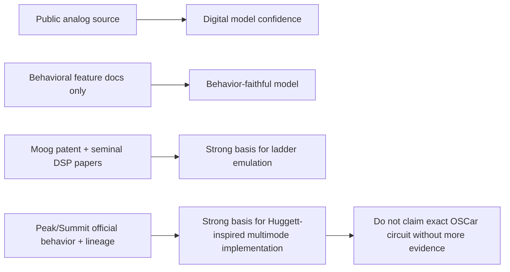
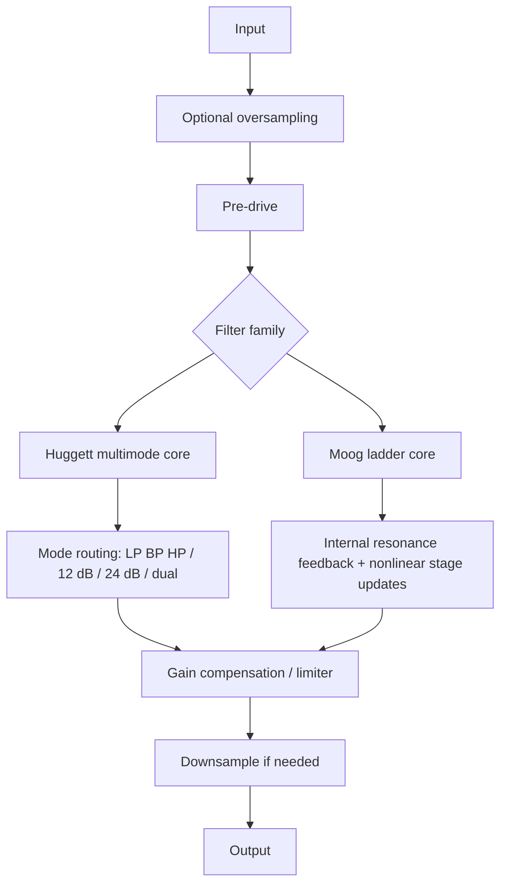

# AI Coding Agent Specification Research for Huggett and Moog Filters in JUCE VST3

> **Second Moog dossier (2026-06-17, v5.01):** [filter-dossiers-sem-moog.md](filter-dossiers-sem-moog.md) corroborates and sharpens this report — adds D'Angelo-Välimäki (ICASSP 2013 / TASLP 2014), the `ddiakopoulos/MoogLadders` C++ comparison repo, the `juce::dsp::LadderFilter` API (a ready Moog-style multimode baseline), and Pirkle's output peak-limiter trick for clean self-oscillation without oversampling. This is the **Moog (v5.2)** library entry's source; Moog's patent (US 3,475,623) expired 1986. **AA policy (overrides this dossier):** Bernie uses **ADAA + hand-rolled inline HQ tiers**, *not* a per-voice `juce::dsp::Oversampling` object — see register **Q12** and [antialiasing-adaa.md](antialiasing-adaa.md); apply that to Moog too.

## Executive summary

Two different implementation strategies are warranted because the public source situation is asymmetric. For the **Moog ladder**, there is a well-defined analog primary source in Robert Moog’s 1966 patent, plus a strong body of seminal digital work by Stilson and Smith, Huovilainen, and Zavalishin. That makes a rigorous, agent-ready implementation brief feasible for a genuinely research-grounded JUCE/VST3 plugin. The analog filter in Moog’s patent is a four-stage transistor-ladder low-pass built from bipolar transistor base-emitter resistances; the patent is long expired, and later digital literature gives multiple workable discretizations with explicit trade-offs. citeturn30view0turn31view0turn31view1turn27view0

For **Chris Huggett’s filter lineage**, the public record is much less explicit at the circuit level. Official Novation sources clearly document the **behavioral feature set** of Peak and Summit: multimode analog filters, 12 dB and 24 dB slopes, dual-filter combinations on Summit, filter-frequency separation, pre-filter overdrive, and explicit lineage “with roots in the legendary OSCar.” Official Novation editorial material also says that **state-variable filters are a Huggett signature**, especially when filter-width behavior is involved. What the reviewed primary/official sources do **not** provide is a public official schematic or a formal DSP model for an exact “OSCar/Peak/Summit filter” emulation. Therefore, the research-supported recommendation is to brief the coding agent toward a **Huggett-inspired, state-variable-derived multimode architecture** that reproduces the documented control behavior of Peak/Summit, while explicitly labeling any “OSCar-exact” claim as **unsupported unless supplemented by additional circuit documentation or hardware measurement**. citeturn7search2turn7search4turn13search0turn17view1turn17view4turn18search2

For the **recommended digital methods**, the best default for a Huggett-style multimode filter in JUCE is a **TPT state-variable topology**: JUCE itself documents `juce::dsp::StateVariableTPTFilter` as a TPT structure designed for fast modulation and based on an analog state-variable circuit. For the Moog ladder, the most defensible implementation plan is a staged approach: start with a **linear ZDF/TPT-style ladder** for correctness and controllability, then add **nonlinearity and oversampling**. Huovilainen’s method remains a seminal nonlinear real-time reference, while Zavalishin provides the broader zero-delay-feedback framework and nonlinear solving guidance. JUCE’s built-in `juce::dsp::LadderFilter` is useful as a baseline or regression oracle, but it should not be treated as a substitute for a source-faithful research implementation if the goal is a serious ladder model. citeturn29view0turn29view1turn31view1turn27view0turn29view2turn29view3

Your requested deliverables should therefore be split into **two agent-spec files** rather than one monolith: one for a **Moog Ladder VST3 plugin**, and one for a **Huggett Multimode VST3 plugin**. Each should include a target DSP architecture, header/source layout, explicit real-time constraints, build instructions using the JUCE CMake API, test plans, GUI/automation notes, and licensing constraints. CPU and memory targets remain **unspecified** in the request, so the brief should state that explicitly and define optimization goals qualitatively rather than numerically. citeturn24view0turn25search4turn25search5

## What the sources do and do not specify

For the **Moog ladder**, the analog source is unusually strong. Moog’s patent describes a four-section low-pass filter whose stages use transistor base-emitter dynamic resistance as the variable resistance element, with resonance obtained by variable feedback; the patent explicitly notes oscillation at sufficient feedback and records the filing/publication timeline. Stilson and Smith then analyze the continuous-time four-pole structure and show that common discretizations such as bilinear and backward-difference introduce a delay-free loop unless handled specially. Huovilainen later derives a nonlinear digital model directly from the transistor ladder and solves it using Euler integration, arriving at cascaded one-pole sections with embedded nonlinearities and practical tuning compensation. Zavalishin’s text systematizes these topics as part of a larger virtual-analog and zero-delay-feedback framework. citeturn30view0turn31view0turn31view1turn27view0

For the **Huggett side**, official Novation documentation is detailed enough to define the **user-facing filter behavior** but not to prove an exact circuit identity. Peak is documented as having an analog multimode filter per voice with LP/BP/HP, 12 dB or 24 dB slopes, resonance, key tracking, Oscillator 3 filter modulation, and dedicated pre-filter drive; its product page explicitly connects the instrument to Chris Huggett and says Peak has its origin in Bass Station II. Summit is documented even more clearly: each voice has **two 12 dB/octave analog filter sections**, which can be cascaded for 24 dB behavior or combined in “Dual” mode as series or parallel pairs with filter-frequency separation. Summit’s product page also states that its analog path has “roots in the legendary OSCar, via Bass Station II.” citeturn7search1turn10view0turn10view2turn11search4turn17view1turn17view4turn7search2

The most important interpretive source for Huggett topology is Novation’s own editorial material quoting Alex Ball: he identifies **state-variable filters** as a “Huggett signature,” especially when “filter width” behavior is present, and says Peak and Summit carry Huggett’s fingerprints strongly. Taken together with Summit’s official documentation of two 12 dB multimode sections plus frequency separation, the best-supported inference is that an AI coding agent should target a **state-variable-derived dual multimode filter architecture** rather than a ladder architecture for the Huggett spec. This is still an inference, not a published schematic, and the spec file should say so plainly. citeturn18search2turn17view1turn17view4

That leads to a critical wording recommendation for the agent files: the Moog brief may say **“research-grounded ladder emulation.”** The Huggett brief should say **“behavior-faithful Huggett-inspired multimode model based on public Peak/Summit documentation and official lineage notes; exact OSCar/Peak/Summit circuit emulation not publicly established by the reviewed official sources.”** That distinction will protect the implementation from overclaiming, and it is the single most important source-driven conclusion in this report. citeturn7search2turn7search4turn11search4turn18search2



## Recommended discretization methods and trade-offs

For the **Huggett-style filter**, the recommended discretization is **TPT**. JUCE documents its `StateVariableTPTFilter` as a TPT state-variable structure designed for fast modulation and fewer cutoff-change artifacts than ordinary IIR forms, though it still notes that additional smoothing may be needed for cutoff changes. That lines up almost perfectly with the Peak/Summit control surface, which is fundamentally about dynamically modulated multimode filtering rather than about reproducing transistor-ladder asymmetry. A practical implementation should therefore treat each 12 dB section as a TPT SVF cell, then build Peak and Summit behaviors by routing and combining those cells. citeturn29view0turn29view1turn17view1turn17view4

For the **Moog ladder**, there is no single universally best method; there is a best **development path**. Stilson and Smith expose why naive conversions are unsatisfactory for a faithful voltage-controlled ladder, especially with resonance and control-signal behavior. Huovilainen offers a real-time-friendly nonlinear Euler cascade with embedded nonlinearities and tuning fixes, explicitly stating that some oversampling is required to control aliasing. Zavalishin generalizes the problem and provides the conceptual framework for zero-delay feedback, nonlinear loop solving, and more modern integration choices. In practice, that means the agent should be allowed to choose between a **Huovilainen-style explicit nonlinear cascade** and a **ZDF/TPT-inspired nonlinear ladder solved per sample or per oversampled sample**, depending on the desired complexity and CPU budget. citeturn31view0turn31view1turn32view0turn32view2turn27view0turn28view0

### Comparison of discretization approaches

| Approach | Best use here | Accuracy to analog behavior | Stability and modulation behavior | CPU cost | Recommendation |
|---|---|---:|---:|---:|---|
| Forward Euler one-pole chaining | Fast prototypes, educational baselines | Low to moderate; frequency warping and resonance behavior are weak | Simple but not ideal under aggressive modulation | Low | Accept only as a temporary scaffold, not final for either filter. Huovilainen uses Euler specifically in a nonlinear ladder context with oversampling and compensation, not as a generic endorsement. citeturn32view2turn31view1 |
| Backward Euler | Conservative linear prototypes | Better stability than forward Euler, but less faithful than TPT at audio-rate modulation | Stable, but can sound overly damped | Low | Possible for coarse references; not preferred for flagship synth filter work. Stilson/Smith discuss backward-difference in the Moog context and the associated delay-free-loop issue. citeturn31view0 |
| Bilinear transform | Static or lightly modulated linear designs | Good linear frequency mapping with prewarping | Still problematic in feedback structures unless algebraically resolved | Low to medium | Useful as theory and for reference curves, but not sufficient alone for the resonant ladder loop. citeturn31view0turn27view0 |
| TPT state-variable | Huggett/Peak/Summit-inspired multimode filter | High for behavioral multimode work | Excellent for fast modulation; JUCE explicitly positions it that way | Low to medium | **Best default for Huggett-inspired implementation.** citeturn29view0turn29view1turn17view1 |
| Linear ZDF ladder | Clean controllable Moog baseline | High in linear regime | Very good, with analytically resolved internal feedback | Medium | **Best first milestone for Moog implementation** before adding nonlinearities. citeturn27view0turn31view0 |
| Nonlinear Huovilainen ladder | Musical Moog character with practical runtime | High for classic nonlinear behavior | Good in practice with oversampling and compensation | Medium | **Best research-backed nonlinear ladder reference design** for a shipping plugin if complexity remains manageable. citeturn31view1turn32view0turn32view2 |
| Nonlinear ZDF with Newton or closed-form approximations | Highest-fidelity modern ladder work | Potentially highest | Excellent if solver is well-conditioned | Medium to high | Best for an advanced version, not necessarily the first implementation milestone. Zavalishin explicitly treats nonlinear zero-delay feedback equations and iterative methods. citeturn27view0turn28view0 |
| One-sample delay inserted in feedback loop, then compensated | Compatibility or fallback mode | Moderate | Easier to implement, but resonance tuning shifts unless compensated | Low to medium | Acceptable fallback for Huovilainen-style tuning-compensated variants; not ideal as the main “exact” path. citeturn32view0 |

### Delay-free feedback handling

For the **Huggett-style multimode filter**, the delay-free-loop problem is mostly solved by using a **TPT SVF formulation from the outset**. The brief should tell the coding agent not to assemble a multimode filter by naively updating textbook biquads per sample; instead, it should implement one stable state-variable cell whose algebra already resolves the internal feedback relationships, then create 24 dB modes by cascading two cells and Summit dual modes by routing cells in series or parallel. This is the most direct way to match Summit’s documented “two 12 dB sections per voice” design. citeturn29view0turn17view1turn17view4

For the **Moog ladder**, the brief should explicitly call out the delay-free-feedback issue as central, not incidental. Stilson and Smith say the common bilinear and backward-difference routes produce a delay-free loop that cannot be used without introducing an ad hoc delay. Zavalishin then provides the more general zero-delay-feedback framework, including nonlinear ZDF equations and iterative solution methods. The coding agent should therefore be required to implement one of two clearly named policies: **Policy A: linear algebraic ZDF ladder**, or **Policy B: nonlinear ladder with oversampled per-sample explicit update and compensation**. That removes ambiguity and prevents the common failure mode of silently inserting a unit delay in the resonance path. citeturn31view0turn27view0turn28view0

### Anti-aliasing and nonlinearities

The source consensus is straightforward: once you add sizable nonlinearity, **oversampling becomes the practical default**. Huovilainen explicitly says that some oversampling is required to avoid aliasing in the nonlinear ladder. JUCE’s `dsp::Oversampling` is designed exactly for this, supports 2×/4×/8×/16× stages, and documents the FIR-versus-IIR latency and phase trade-off: FIR is more linear-phase but adds more latency; polyphase IIR reduces latency but alters phase near Nyquist. For these synth filters, an agent-ready brief should recommend **2× or 4× by default**, with runtime-selectable oversampling if desired, and should place the nonlinear filter core inside the oversampled region. citeturn32view0turn33view0

For **where to place the nonlinearity**, the sources support a split recommendation. In the Moog ladder, nonlinearity is intrinsic to the transistor differential pair and stage behavior, so the agent should place saturation **inside or around the ladder stages and/or the feedback summing path**, not merely as an external drive box. Huovilainen’s model embeds nonlinearities into the stage equations. Zavalishin’s framework likewise treats saturation as part of the loop mathematics, not a purely cosmetic post effect. By contrast, the Huggett-inspired spec should include **pre-filter drive and optional post-filter drive/limiting** because Peak and Summit explicitly document distortion before the filter, after the filter, and after the VCA in the analog path. citeturn31view1turn27view0turn13search0turn10view0

### Resonance, gain loss, and limiter strategy

Moog-ladder resonance demands gain management. Stilson and Smith describe the four cascaded one-pole sections and note self-oscillation as feedback approaches the critical point; Zavalishin explicitly notes the general low-frequency gain drop of ladder filters as resonance rises. Therefore the agent brief should require **resonance-aware gain compensation** and a **soft ceiling** rather than a hard clip. A small amount of saturating feedback-path compression or `tanh`-style limiting in the resonance loop is musically preferable to top-level clipping, and it is more consistent with the analog literature. citeturn31view0turn28view2turn27view0

Peak’s official manual says high resonance can increase output level enough to cause unwanted clipping and suggests compensating with VCA gain. That is a strong product-level clue for the Huggett-inspired plugin: when resonance or drive rise, the DSP should apply **predictable level compensation** and optionally expose an output trim or “auto gain” switch. For Summit-style dual filters, the agent should also preserve the documented **frequency-separation** behavior in series and parallel configurations; that is part of the instrument’s identity, not a secondary flourish. citeturn10view3turn17view4



## JUCE and VST3 implementation blueprint

The build system should be **CMake-first**, not Projucer-first, because the JUCE CMake API is now mature and explicit. JUCE’s official CMake API states that `juce_add_plugin` creates the shared-code target and per-format plugin targets, and that `FORMATS VST3` should be supplied for a desktop VST3 build. The same documentation also specifies that CMake 3.22 or higher is required. JUCE’s plugin tutorial further states that recent JUCE versions package what is needed for VST3 builds, and it describes using `AudioPluginHost` as a straightforward debugging host. citeturn24view0turn4search0

For parameters and state, the correct JUCE center of gravity is `AudioProcessorValueTreeState`. JUCE documents APVTS as the processor-wide state container, with a constructor that takes a `ParameterLayout`, and it explicitly provides `getRawParameterValue()` returning an atomic float pointer suitable for reading current values in real-time processing. For the agent file, parameters should therefore be defined once in `createParameterLayout()`, with all DSP code consuming atomics or copied block-local snapshots in `processBlock()`. citeturn19view0

For parameter mapping, the brief should direct the agent to use **log/exponential mapping** for frequency-like parameters and **linear or perceptually tuned ranges** for resonance, drive, and mix parameters. VST3 requires all exported parameters to be represented as normalized 0..1 values, and it distinguishes continuous versus discrete parameters through `stepCount`. JUCE’s `NormalisableRange` is built for exactly this purpose and supports skew and custom mapping functions. `SmoothedValue` should be used for at least cutoff, resonance, drive, and mix; JUCE documents multiplicative smoothing as especially suitable for logarithmic domains such as frequency in Hz. citeturn21view0turn35search0turn34view0

For the GUI and automation contract, VST3 matters even when JUCE hides much of the wrapper detail. Steinberg’s documentation says automation playback reaches the processor **only through the process call**, that the host transmits data in a form that allows sample-accurate reconstruction, and that the plugin is responsible for realizing that automation. Steinberg’s advanced tutorial shows the sample-accurate pattern: read `inputParameterChanges`, slice blocks or advance parameter values appropriately, and support 32-bit and 64-bit processing when needed. In a JUCE plugin, the simplest practical equivalent is to update smoothed targets per block and consume them per sample inside the DSP loop for cutoff-critical controls. citeturn21view0turn22view0turn22view1

### Recommended file layout

The coding agent should be told to generate two sibling DSP modules and one shared plugin shell:

```text
Source/
  PluginProcessor.h
  PluginProcessor.cpp
  PluginEditor.h
  PluginEditor.cpp
  Parameters.h
  Parameters.cpp
  Dsp/
    Common/
      FilterCommon.h
      Saturation.h
      OversamplingManager.h
      BiquadAnalysis.h
    Huggett/
      HuggettFilter.h
      HuggettFilter.cpp
      HuggettVoiceModel.h
      HuggettVoiceModel.cpp
    Moog/
      MoogLadder.h
      MoogLadder.cpp
      MoogLadderLinear.h
      MoogLadderNonlinear.h
      MoogTuningCompensation.h
  Tests/
    FilterResponseTests.cpp
    AutomationTests.cpp
    NonlinearityTests.cpp
    RegressionReferenceWavs.cpp
CMakeLists.txt
README.md
docs/
  agent-spec-huggett.md
  agent-spec-moog.md
```

This split reflects the research reality: the two filters should share infrastructure, not a forced common DSP core. The Huggett implementation is fundamentally a multimode routing problem over one or two 12 dB cells; the Moog implementation is fundamentally a resonant ladder with nonlinear feedback and tuning compensation. citeturn17view1turn17view4turn31view0turn31view1

### Minimal JUCE CMake scaffold

```cmake
cmake_minimum_required(VERSION 3.22)
project(FilterResearchPlugins VERSION 0.1.0)

add_subdirectory(JUCE)

juce_add_plugin(FilterResearch
    COMPANY_NAME "YourCompany"
    BUNDLE_ID com.yourcompany.filterresearch
    PLUGIN_MANUFACTURER_CODE Ycmp
    PLUGIN_CODE Fltr
    FORMATS VST3 Standalone
    PRODUCT_NAME "FilterResearch"
    PLUGIN_NAME "FilterResearch"
    IS_SYNTH FALSE
    NEEDS_MIDI_INPUT FALSE
    NEEDS_MIDI_OUTPUT FALSE
)

target_sources(FilterResearch PRIVATE
    Source/PluginProcessor.cpp
    Source/PluginEditor.cpp
    Source/Parameters.cpp
    Source/Dsp/Huggett/HuggettFilter.cpp
    Source/Dsp/Huggett/HuggettVoiceModel.cpp
    Source/Dsp/Moog/MoogLadder.cpp
)

target_link_libraries(FilterResearch PRIVATE
    juce::juce_audio_utils
    juce::juce_dsp
)

target_compile_definitions(FilterResearch PRIVATE
    JUCE_WEB_BROWSER=0
    JUCE_USE_CURL=0
)
```

This matches JUCE’s official `juce_add_plugin` model and keeps the project in the supported CMake flow. VST3 bundle structure and installation locations are then handled by the plugin format itself, with Steinberg documenting the `.vst3` bundle format and standard plugin locations on each platform. citeturn24view0turn3search0turn3search2turn3search4

### Shared parameter model

A good agent file should require at least these parameter groups:

| Group | Huggett-inspired plugin | Moog plugin |
|---|---|---|
| Core | cutoff, resonance, mode, slope, drive, output | cutoff, resonance, drive, output |
| Extended | dualMode, filterSeparation, preDrive, postDrive, keyTrack, envAmt, lfoAmt | oversampling, nonlinearMode, compensationMode, selfOscTrack |
| Utility | bypass, quality, smoothing time | bypass, quality, smoothing time |

The VST3 side should mark continuous parameters as continuous and discrete selectors as stepped. Steinberg documents normalized transport and `stepCount`; JUCE’s ranged-parameter model converts between normalized and plain values through `NormalisableRange`. citeturn21view0turn35search3

### Example parameter layout snippet

```cpp
juce::AudioProcessorValueTreeState::ParameterLayout createParameterLayout()
{
    using namespace juce;

    AudioProcessorValueTreeState::ParameterLayout layout;

    auto hzRange = NormalisableRange<float>(
        20.0f, 20000.0f,
        [](float start, float end, float n)
        {
            return start * std::pow(end / start, n);
        },
        [](float start, float end, float hz)
        {
            return std::log(hz / start) / std::log(end / start);
        });

    layout.add(std::make_unique<AudioParameterFloat>("cutoff", "Cutoff", hzRange, 1000.0f));
    layout.add(std::make_unique<AudioParameterFloat>("resonance", "Resonance", 0.0f, 1.0f, 0.0f));
    layout.add(std::make_unique<AudioParameterFloat>("drive", "Drive", 1.0f, 12.0f, 1.0f));
    layout.add(std::make_unique<AudioParameterChoice>("family", "Family",
                                                      StringArray{"Huggett", "Moog"}, 0));
    layout.add(std::make_unique<AudioParameterChoice>("mode", "Mode",
                                                      StringArray{"LP12", "LP24", "BP12", "BP24", "HP12", "HP24"}, 0));
    return layout;
}
```

This pattern aligns with APVTS usage, VST3 normalized parameter handling, and JUCE’s support for custom normalizable mappings. citeturn19view0turn21view0turn35search0

## Agent-ready deliverables and code skeletons

The required output for the AI coding agent should be stated explicitly. The research supports asking for **two markdown specification files**, not just source code. The brief should require:

| Deliverable | Purpose |
|---|---|
| `agent-spec-huggett.md` | Behavioral brief for a Peak/Summit/OSCar-lineage multimode filter plugin, explicitly marked as a behavior-faithful rather than circuit-proven emulation |
| `agent-spec-moog.md` | Research-grounded brief for a Moog ladder plugin with milestone path from linear ZDF to nonlinear/oversampled ladder |
| DSP skeletons | Minimal compilable class definitions and stubs |
| `CMakeLists.txt` | JUCE CMake build |
| test plan doc | unit, integration, and regression plan |
| README | build, run, test, known limitations |

### Huggett-inspired core skeleton

```cpp
class HuggettFilter
{
public:
    enum class Mode { lp12, lp24, bp12, bp24, hp12, hp24, dualSeries, dualParallel };

    void prepare(double sampleRate, int maxBlockSize, int numChannels);
    void reset();

    void setCutoffHz(float hz) noexcept;
    void setResonance(float q) noexcept;
    void setDrive(float drive) noexcept;
    void setMode(Mode newMode) noexcept;
    void setDualSeparation(float octaves) noexcept;

    float processSample(int ch, float x) noexcept;

private:
    struct Cell
    {
        juce::dsp::StateVariableTPTFilter<float> svf;
    };

    std::vector<Cell> a_, b_;
    juce::SmoothedValue<float, juce::ValueSmoothingTypes::Multiplicative> cutoff_;
    juce::SmoothedValue<float> resonance_;
    juce::SmoothedValue<float> drive_;
    Mode mode_ { Mode::lp24 };
    float separationOctaves_ = 0.0f;

    static inline float softSat(float x) noexcept
    {
        return std::tanh(x);
    }
};
```

This skeleton is justified by JUCE’s TPT SVF support and by Summit’s and Peak’s documented dual/single multimode behavior. It is not an “exact OSCar schematic translation”; the spec should say that explicitly. citeturn29view0turn17view1turn17view4

### Moog ladder core skeleton

```cpp
class MoogLadder
{
public:
    enum class NonlinearMode { linearZdf, huovilainenStyle };

    void prepare(double sampleRate, int maxBlockSize, int numChannels);
    void reset();

    void setCutoffHz(float hz) noexcept;
    void setResonance(float r) noexcept;   // normalized user value
    void setDrive(float d) noexcept;
    void setOversamplingFactor(int factor); // 1, 2, 4...
    void setNonlinearMode(NonlinearMode mode) noexcept;

    void processBlock(juce::AudioBuffer<float>& buffer);

private:
    double fs_ = 44100.0;
    NonlinearMode mode_ = NonlinearMode::linearZdf;

    juce::SmoothedValue<float, juce::ValueSmoothingTypes::Multiplicative> cutoff_;
    juce::SmoothedValue<float> resonance_;
    juce::SmoothedValue<float> drive_;

    std::unique_ptr<juce::dsp::Oversampling<float>> oversampling_;

    float processSampleLinear(float x, int ch) noexcept;
    float processSampleNonlinear(float x, int ch) noexcept;
};
```

This class keeps the architectural decision explicit. It is source-aligned because Huovilainen’s nonlinear ladder, Zavalishin’s ZDF framing, and JUCE’s oversampling facilities are all conceptually distinct and should not be collapsed into a vague “ladder filter” bucket. citeturn31view1turn27view0turn33view0

### JUCE processing pattern

```cpp
void FilterResearchAudioProcessor::processBlock(juce::AudioBuffer<float>& buffer,
                                                juce::MidiBuffer&)
{
    juce::ScopedNoDenormals noDenormals;

    const auto numChannels = getTotalNumOutputChannels();
    const auto numSamples  = buffer.getNumSamples();

    auto* cutoff = apvts.getRawParameterValue("cutoff");
    auto* reso   = apvts.getRawParameterValue("resonance");
    auto* drive  = apvts.getRawParameterValue("drive");
    auto* family = apvts.getRawParameterValue("family");

    if ((int) family->load() == 0)
    {
        huggett.setCutoffHz(cutoff->load());
        huggett.setResonance(reso->load());
        huggett.setDrive(drive->load());

        for (int ch = 0; ch < numChannels; ++ch)
            for (int n = 0; n < numSamples; ++n)
                buffer.setSample(ch, n, huggett.processSample(ch, buffer.getSample(ch, n)));
    }
    else
    {
        moog.setCutoffHz(cutoff->load());
        moog.setResonance(reso->load());
        moog.setDrive(drive->load());
        moog.processBlock(buffer);
    }
}
```

The essential research-backed point here is not the syntax but the discipline: APVTS atomics for the audio thread, per-sample smoothing inside the DSP objects, and no dependence on GUI-thread state for DSP correctness. citeturn19view0turn21view0

### Implementation checklist for the coding agent

- Define the project as **two filter engines under one JUCE shell** or as two separate plugin targets if product separation is preferred. citeturn24view0
- Build the Huggett engine from **one or two TPT SVF cells** with LP/BP/HP outputs, 12 dB/24 dB routing, Summit-style dual series/parallel combinations, and filter-frequency separation. citeturn29view0turn17view1turn17view4
- Build the Moog engine in milestones: **linear reference**, then **nonlinear ladder**, then **oversampled nonlinear ladder with compensation**. citeturn31view0turn31view1turn32view0
- Use `AudioProcessorValueTreeState` with `ParameterLayout`; all DSP reads should come from atomics or copied snapshots. citeturn19view0
- Use `NormalisableRange` for parameter-domain mapping and `SmoothedValue` for cutoff, resonance, drive, and any modulation-depth parameters that can produce zipper noise. citeturn35search0turn34view0
- Put nonlinear stages inside an oversampled region when drive is active; expose the oversampling factor as a quality parameter if desired. citeturn33view0turn32view0
- Implement gain compensation around resonance and drive, especially in ladder mode. citeturn28view2turn10view3
- Test in JUCE `AudioPluginHost` and at least one production DAW. JUCE’s official tutorial recommends `AudioPluginHost` for fast plugin debugging. citeturn4search0
- Keep the spec explicit that **CPU and memory targets are unspecified** and that final optimization thresholds must be chosen after profiling. 

## Testing, real-time constraints, GUI notes, and licensing

### Test plan

The unit and integration test plan should be unusually strict because filters can “sound fine” while being mathematically wrong. At minimum, the coding agent should generate offline DSP tests for steady-state frequency response, impulse and step response, cutoff tracking under automation, resonance gain behavior, and self-oscillation frequency behavior. The Moog suite should compare at least one linear reference against the nonlinear mode with the same cutoff and resonance settings, and log tuning drift across the band. Since Huovilainen explicitly discusses tuning compensation and oversampling effects, those must be regression-tested rather than left to ear alone. citeturn32view0turn31view1

For anti-aliasing and nonlinearity validation, the test plan should include harmonically rich inputs such as saw waves and broadband noise, rendered with oversampling off and on, followed by FFT comparison of foldback content. JUCE’s oversampling documentation makes it clear that oversampling exists precisely to support nonlinear blocks while managing aliasing, and it documents latency implications that should also be tested at the plugin-host level. citeturn33view0

For plugin integration, the brief should require loading in a simple host via `AudioPluginHost`, then validating parameter automation in at least one mainstream DAW. VST3’s parameter model requires normalized 0..1 transport and permits sample-accurate reconstruction by the plugin; hosts deliver parameter changes in the processing call, so automation tests should focus on cutoff sweeps, resonance jumps, and stepped mode switches. GUI playback is handled by the host on the UI thread, while processor-side realization remains the plugin’s responsibility. citeturn4search0turn21view0

### Real-time constraints

The request leaves CPU and memory targets unspecified, so the brief should say that exactly. Even so, the real-time contract should be firm: the audio thread should read atomics from APVTS, avoid architectural dependence on GUI thread timing, and keep smoothing and filter updates deterministic per sample or per processing slice. Steinberg’s VST3 documentation describes the API as designed for real-time audio components, and JUCE’s APVTS documents real-time-readable atomic parameter access. citeturn20view1turn19view0

A practical quality-tier strategy is appropriate. The Moog plugin can offer a low-quality linear mode, a medium-quality nonlinear mode, and a high-quality oversampled nonlinear mode. The Huggett plugin can likely remain efficient enough with TPT cells that quality settings become mainly about oversampling of drive stages, not about the filter core itself. This division follows directly from the much heavier nonlinear burden in the ladder literature. citeturn29view0turn31view1turn33view0

### GUI integration notes

The GUI should visualize **mode and routing**, not just expose knobs. For the Huggett-inspired plugin, a small routing diagram or two-cell filter topology display will materially help users understand Peak/Summit-style dual combinations and separation. For the Moog plugin, a four-stage ladder graphic and oversampling/nonlinear-mode indicator would be more meaningful than an abstract EQ plot alone. VST3 also allows snapshot imagery inside the bundle, which Steinberg documents as part of the VST3 format since 3.6.10, though this is optional. citeturn17view4turn21view2

In JUCE, parameter attachments should use APVTS slider/button/combobox attachments rather than manual glue code wherever possible. The APVTS documentation explicitly includes these attachment helpers, which keeps controller state synchronized with host automation and plugin state serialization. citeturn19view0

### Licensing considerations

The **VST3 SDK** is now under the **MIT license** as of VST 3.8, with no fees, no required signed agreement, and no source-disclosure requirement under MIT. Steinberg’s trademark guidance is separate from the SDK license: using the term “VST” and especially the VST logo or branding remains subject to Steinberg’s usage guidelines. The agent spec should therefore distinguish carefully between **technical format support** and **trademark usage** in names, logos, websites, and manuals. citeturn25search1turn25search4turn25search6

The **JUCE framework** is not MIT-licensed in the same way. JUCE’s official licensing information says JUCE is dual licensed under the JUCE license and AGPLv3, and closed-source distribution generally requires an appropriate JUCE license unless your usage falls within AGPL terms. Therefore the agent file should not state or imply that the resulting JUCE plugin may always be distributed commercially with no further licensing decision. That depends on how you license and distribute the final product. citeturn25search5

For the **Moog analog topology**, the original patent has expired, so the core circuit idea itself is not an active patent barrier in the United States according to the patent record reviewed. That does **not** grant rights to others’ brand names, proprietary GUI assets, factory presets, or copyrighted manuals, and the agent brief should avoid any language suggesting otherwise. citeturn30view0

## Open questions and limitations

The principal unresolved issue is the **exact public-circuit definition of “Chris Huggett’s filter from Summit, Peak and OSCar.”** The reviewed official Novation sources specify behavior, routing, slopes, frequency separation, overdrive locations, and design lineage, and Novation editorial material strongly suggests a state-variable family resemblance. However, I did **not** find a reviewed public official schematic or formal DSP note proving an exact OSCar/Peak/Summit filter circuit or a single canonical “Huggett filter” transfer structure. Any claim of exact emulation would therefore need either additional primary circuit documentation, teardown-level evidence, or hardware measurement work. citeturn7search2turn7search4turn17view1turn18search2

Everything else is much firmer. For the Moog ladder, the source path from patent to digital implementation literature is strong enough to support a rigorous agent-ready spec. For the Huggett implementation, the correct research posture is not hesitation but precision: direct the coding agent toward a **behavior-faithful, state-variable-derived multimode implementation with Summit/Peak controls**, and mark OSCar exactness as an open research extension rather than as an established fact. citeturn30view0turn31view0turn31view1turn29view0turn17view1